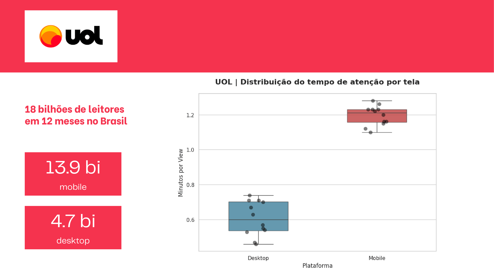
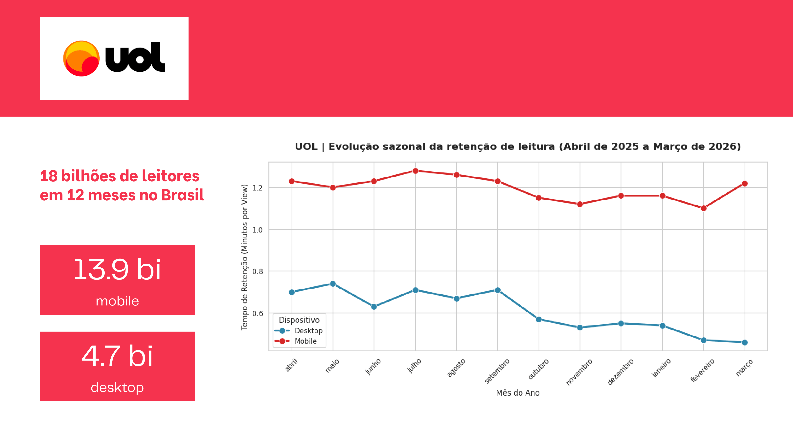
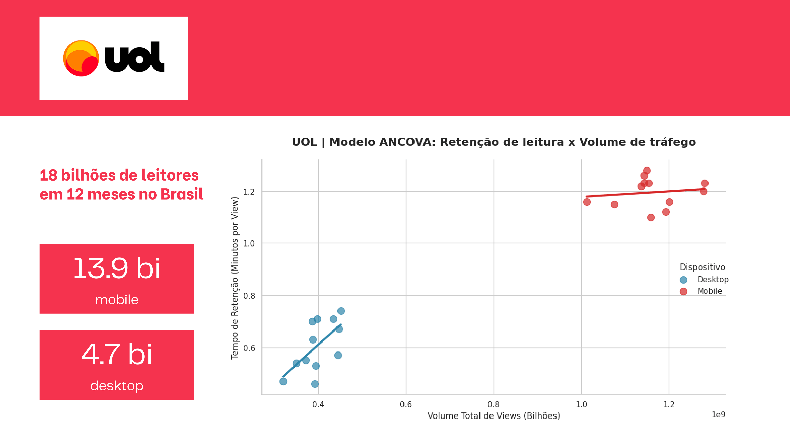
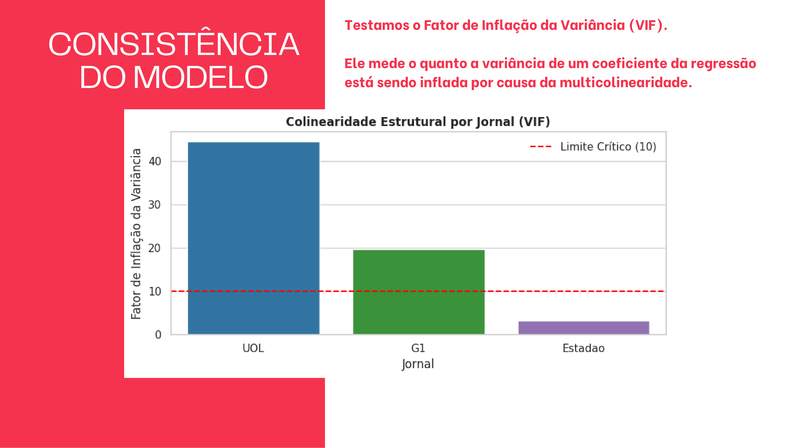
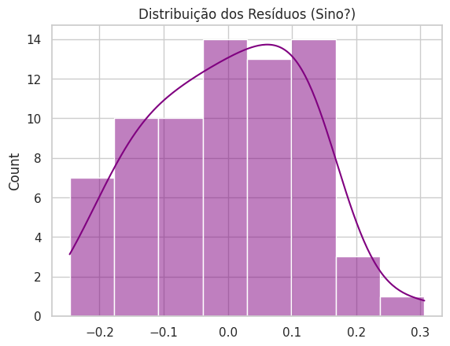
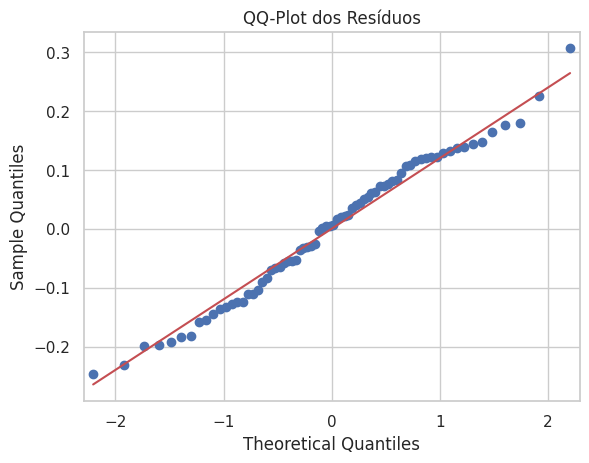

  

# 📊 Digital Journalism: Mobile or Traffic Volume?
### A Comparative Analysis between UOL, G1, and Estadão

Project developed for the **CC0290 - Regression Models I** course, taught by Professor **Rafael Bráz Azevedo Farias** at the Federal University of Ceará (UFC).

## 👥 Team

* **Pedro Lucas Rodrigues de Oliveira Sá** (Data Science & Diagnostics)
* **Raquel Queiroz da Silva** (Pitch & Visual Communication)
* **Wagner Mendes Crispim** (Methodology & Modeling)

## 🎯 Objective

To investigate the association between the volume of views, the access device (Mobile or Desktop), and reading retention in three major Brazilian news portals: UOL, G1, and Estadão.

## 🛠️ Techniques Used

* Multiple Linear Regression
* Multicollinearity Diagnostics (Variance Inflation Factor - VIF)
* Analysis of Covariance (ANCOVA)
* Data Visualization and Interpretation in Python

---

## 📈 Exploratory Data Analysis (EDA)

Before modeling, we explored the marginal behavior of our variables. The data clearly shows an overwhelming structural advantage for Mobile devices across the board, both in absolute traffic and retention stability over time.

  
  

---

## 🔍 Key Insights & Methodology

The core of our analysis revealed a severe statistical challenge: **Multicollinearity**. 

When plotting the correlation between Volume and Retention (Scatterplot below), we observed a "statistical myopia" in portals with massive traffic like UOL. By calculating the **Variance Inflation Factor (VIF)**, we discovered that the Mobile traffic volume completely masked the independent effects of the variables (VIF > 40). Estadão, having a more balanced audience, served as our natural control group.

  
  

### Model Diagnostics: Residuals & Normality
To validate the reliability of our ANCOVA model and its P-values, we performed residual diagnostics. The tests (Omnibus and Jarque-Bera) and visual plots confirmed that the model's errors follow a normal distribution, securing our statistical inferences.

  
  

---

## 🚀 Conclusions & Business Recommendations

Our findings prove that mobile audience retention is categorically superior. Relying solely on raw traffic metrics is a mistake. These models guide targeted corporate investments, advertising strategies, and seasonal content planning.

  

---

## 📁 Repository Structure

* `Relatorio_Tecnico.pdf`: Technical report specifying the intellectual contributions of the team members.
* `Apresentacao_Pitch.pdf`: Visual presentation developed for the project pitch.
* `Analise_Retencao_Comscore.ipynb`: Jupyter Notebook containing the complete analysis process, from data cleaning to regression models and ANCOVA.
* `Comscores_UOL_G1_Estadao.csv`: The raw dataset used in the study.
* `assets/`: Folder containing all images and diagnostic plots used in this documentation.

## 🔗 Links

* **Google Colab (Interactive Notebook):** [Access Here](https://colab.research.google.com/drive/1GuxA5vyoD5EFkKfm3SN-R9mArqJ-yJVs?usp=sharing)
* **Canva Presentation (Pitch Deck):** [Access Here](https://canva.link/jmt657h5t73t67v)
