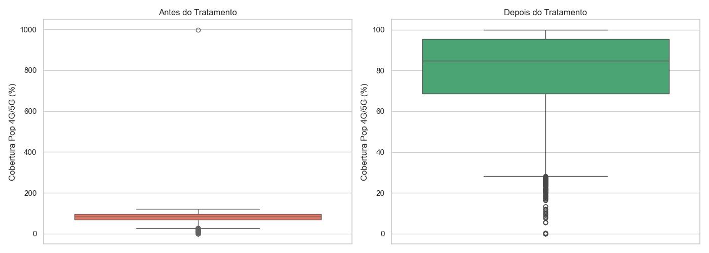
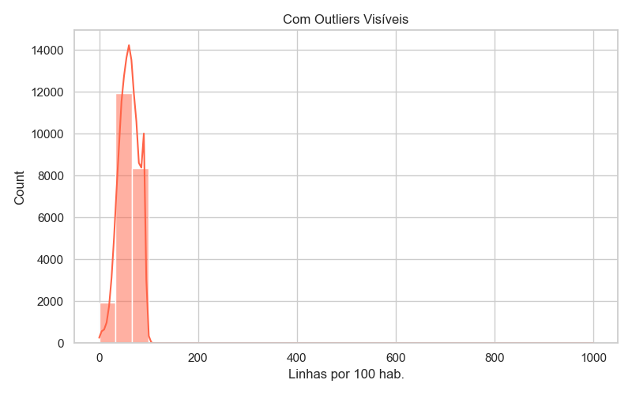
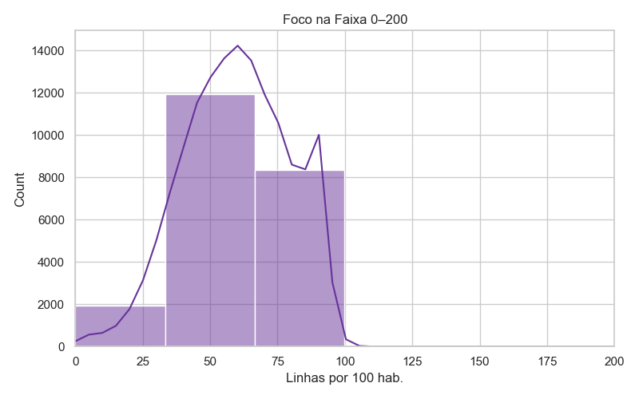
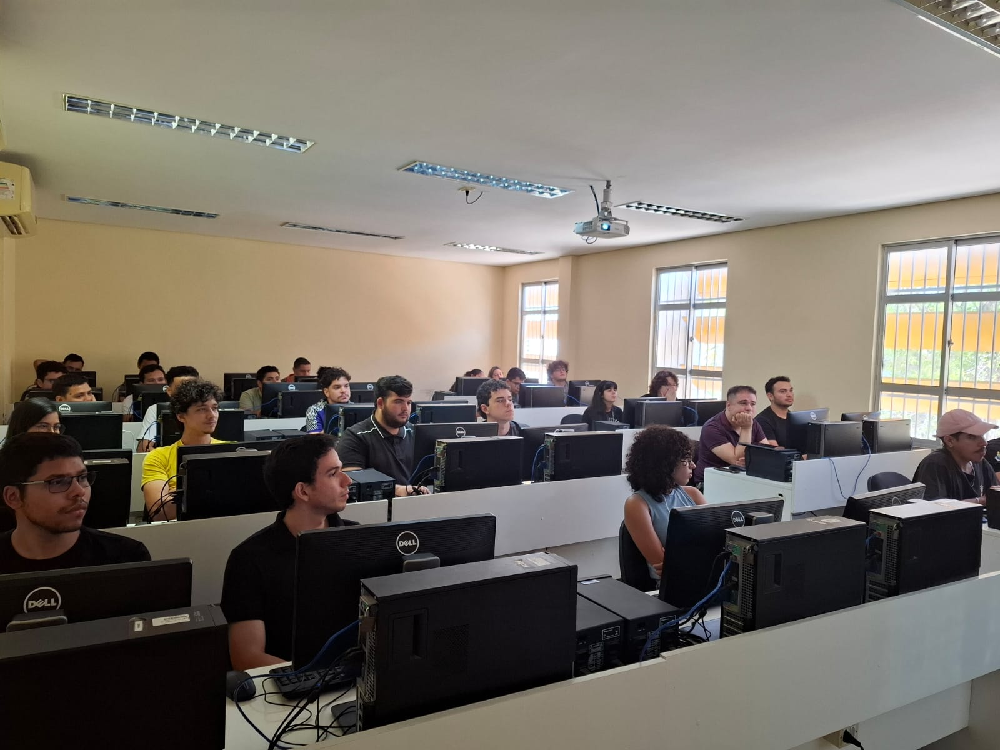
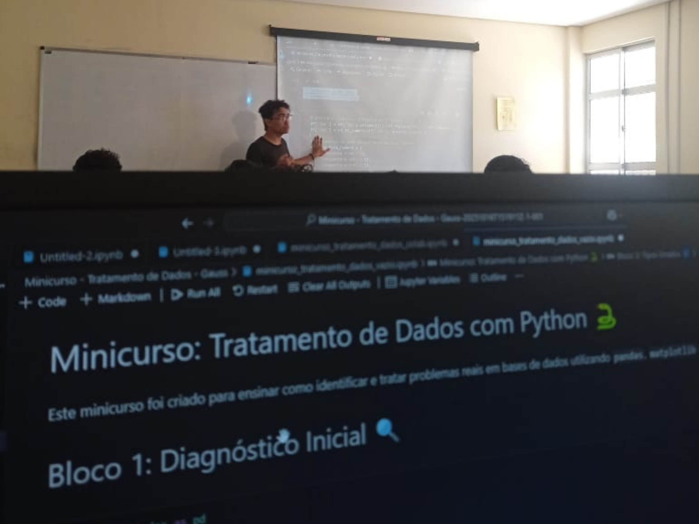
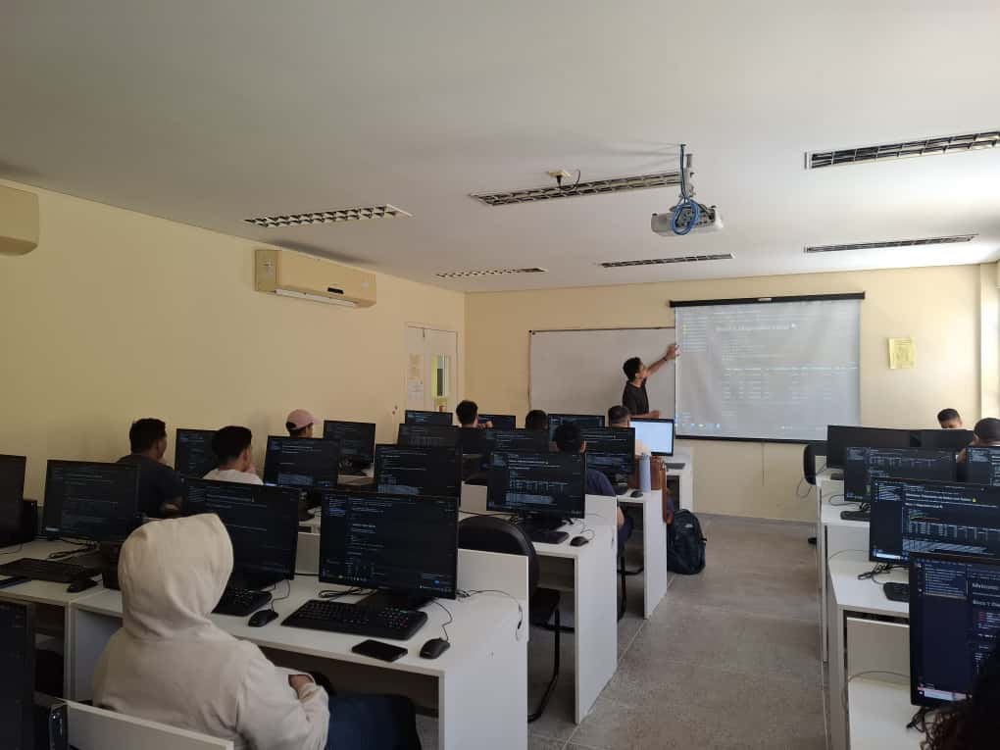
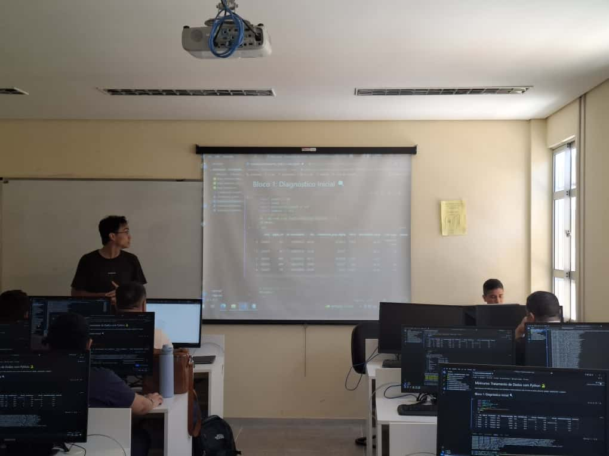

# Python Data Treatment Course - SEst 2025 🐍
### Technical Outreach by Gauss Jr. (UFC Statistics Junior Enterprise)

This directory contains the documentation and technical materials for the "Data Treatment with Python" course delivered during the **Statistics Week (SEst) at the Federal University of Ceará (UFC)**.

## 📝 About the Course
The workshop focused on bridging the gap between statistical theory and practical data engineering. As the **Technical Coordinator at Gauss Jr.**, I designed this training using a **synthetic dataset inspired by the real `br_anatel_indice_brasileiro_conectividade_municipio` (Brazilian Connectivity Index)** from ANATEL.

The goal was to simulate a realistic public policy scenario, challenging students to handle common inconsistencies found in government open data pipelines.

## 📊 Technical Highlights
* **Realistic Simulation**: The dataset mimics the structure of the **Brazilian Connectivity Index**, including specific regional anomalies in `densidade_smp` and `hhi_smp`.
* **Advanced Data Wrangling**:
    * **NLP-like Cleaning**: Implemented a dictionary-based mapper to convert text-based numbers (e.g., *"cinquenta e um"*, *"sessenta"*) into floats for the `hhi_smp` column.
    * **String Standardization**: cleaned non-standard characters (e.g., `%`, `,`) and normalized state abbreviations (e.g., mapping *"SÃO PAULO"* to *"SP"*).
    * **Type Casting**: Enforced strict typing for numerical columns using `pd.to_numeric(errors='coerce')` to handle dirty data like `---` entries.
* **Statistical Cleansing**: Detecting and treating outliers in coverage metrics using IQR Boxplots and Histograms.
* **Tooling**: Built entirely using the Python data stack: **Pandas, NumPy, Matplotlib, and Seaborn**.

## 📉 Methodology & Results
Key visualizations demonstrating the data cleaning process performed during the workshop.

### 1. Outlier Treatment (Before vs. After)
This boxplot comparison demonstrates the effectiveness of the interquartile range (IQR) method applied to the dataset. Note the scale correction in the second chart.

### 2. Distribution Analysis
Histograms analyzing the density of "Mobile Lines per 100 inhabitants" (`densidade_smp`).

  
  
   
  <em>Left: Original distribution with skewness | Right: Focused analysis on the 0-200 range.</em>

## 📸 Event Gallery
These records demonstrate the engagement and the practical learning environment during the session.

  
   
  <em>Full house: Undergraduate students participating in the hands-on session.</em>

  
  

  
  

## 📂 Folder Structure
* **/notebooks**: Full Jupyter Notebook with the solved data treatment challenges (`minicurso_tratamento_dados.ipynb`).
* **/data**: Synthetic datasets based on ANATEL's official structure.
* **/docs**: Lesson plan and pedagogical organization.
* **/assets**: Visual records of the event and chart outputs.

---
**Developed by Lucas Sá** *Statistics Student (UFC) | Technical Coordinator & Data Analyst at Gauss Jr.*
