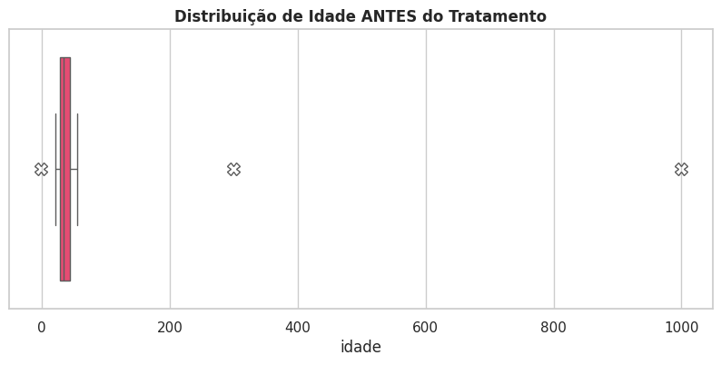
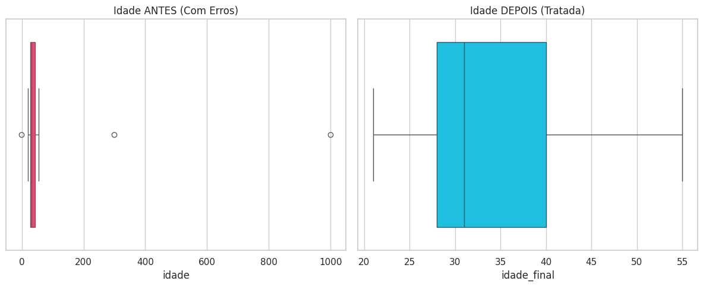
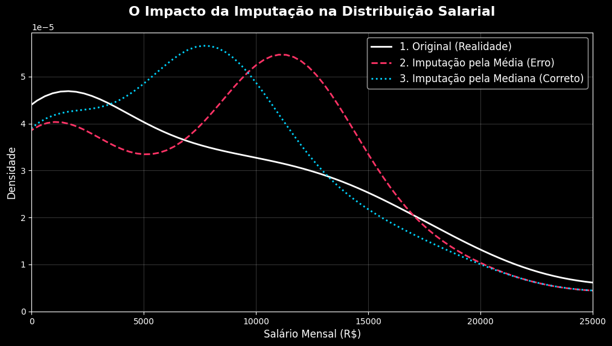

# Python Data Treatment Course - SEST 2026 🐍
### Technical Outreach by Gauss Jr. (UFC Statistics Junior Enterprise)

  
  
  
  
  

 

This directory contains the documentation and technical materials for the "Data Treatment with Python" course delivered during the **Statistics Week (SEST) at the Federal University of Ceará (UFC)** in 2026.

## 📝 About the Course
The 2026 edition was expanded into a **two-day intensive workshop** with a distinct pedagogical progression, elevating students from basic data manipulation to professional-grade data engineering and ETL logic. As the **Technical Coordinator at Gauss Jr.**, I designed this training to simulate chaotic, real-world data environments using two distinct synthetic datasets:

* **Day 1 (Guided Instruction):** Focused on a general consulting client database (`base_clientes_bruta.csv`) to establish fundamentals in anomaly detection, typing, and outlier removal through a guided coding session.
* **Day 2 (Hands-on Challenge):** Shifting from a "code showcase" to a practical lab. Students were given a complex fintech risk assessment dataset named **GaussPay** (`usuarios_gausspay_bruto.csv`) and challenged to independently apply the ETL structures learned on Day 1 to solve mixed date formats, Regex, and advanced statistical imputation.

## 📊 Technical Highlights

### Day 1: Data Wrangling Fundamentals
* **Type Casting & Standardization:** Enforced strict typing for numerical and temporal columns using `pd.to_numeric(errors='coerce')` to safely bypass execution-breaking data corruption.
* **Statistical Cleansing:** Identifying and treating impossible values (e.g., ages like 300 or 999 years old) using IQR and logical boundaries.

### Day 2: Independent ETL & Statistical Decisions
* **The Practical Lab:** Students took the lead, applying Python tools to clean a new dataset from scratch, reinforcing autonomous problem-solving.
* **Regex Mastery:** Implementing *Positive Lookahead* `\.(?=\d{3}(\D|$))` to intelligently identify and remove thousand separators without destroying decimal points in financial columns.
* **The Art of Imputation:** A deep dive into the statistical consequences of filling `NaNs` in the salary column, contrasting the dangers of Mean imputation against the robustness of Median imputation.
* **Target Variable Protection:** Enforcing the golden rule of predictive modeling: never imputing the target variable (`risco_fraude`).

## 📉 Methodology & Results
Key visualizations demonstrating the progression of the data cleaning process over the two days.

### Day 1: Outlier Treatment (Before vs. After)
This boxplot comparison from the first session demonstrates the effectiveness of logical filtering applied to the dataset's anomalies. Note the scale correction in the second chart.

  
  
   
  <em>Left: Initial detection of anomalies | Right: Corrected distribution after treatment.</em>

### Day 2: The Art of Imputation (Mean vs. Median)
Introduced during the GaussPay challenge, this density distribution chart proves the critical danger of naive imputation. Filling missing salaries with the Mean creates an artificial "ghost peak" due to extreme outliers, whereas the Median safely follows the actual population distribution.

## 📸 Event Gallery
> **Status:** ⏳ *Processing official event records... Coming soon!*

*(Photos from the full house and hands-on sessions at SEST 2026 will be updated here shortly).*

## 📂 Folder Structure
* **`/notebooks`**:
  * `First Day - Gabarito_Minicurso_Tratamento_Dados_Gauss_2026.ipynb`
  * `Second Day - Gabarito_GaussPay.ipynb`
* **`/data`**: Synthetic datasets simulating real-world chaos (`base_clientes_bruta.csv` and `usuarios_gausspay_bruto.csv`).
* **`/docs`**: Lesson plans (`Minicurso_Tratamento_Dados_Python.pdf`) and method summaries (`Funções e Métodos Utilizados no Minicurso.pdf`).
* **`/assets`**: Visual records of the event and chart outputs (`comparacao_imputacao.png`, `comparacao_boxplot.png`, `boxplot.png`).

---
> **Developed by Lucas Sá** - *Statistics Student (UFC) | Technical Coordinator & Data Analyst at Gauss Jr.*
