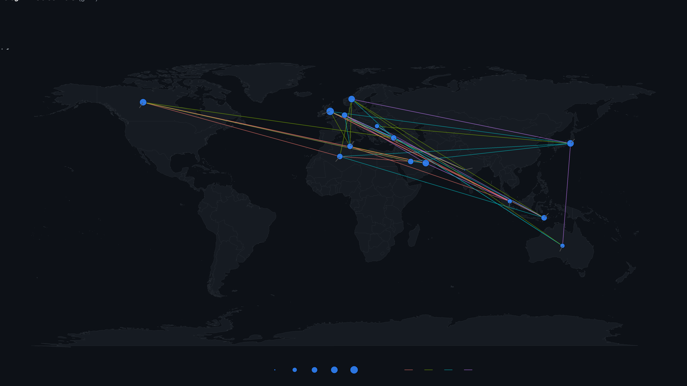

# Introduction to Spatial Statistical Analysis in R 🗺️📊

This repository documents my studies and practical exercises developed during the minicourse **"Introdução à Análise Estatística Espacial, da Visualização com Mapas até a Modelagem Usando o R"**, taught by Prof. Elisângela Lizzi during the **V Encontro Paraibano de Estatística (V EPBEST 2025)**.

The objective of this repository is to consolidate the concepts learned throughout the course and serve as a portfolio of introductory applications involving spatial data visualization, thematic mapping, geostatistics, and spatial interpolation using R.

<div align="center">
  
</div>

---

## 📝 Disclaimer

This repository documents my learning process and practical exercises developed during the minicourse "Introdução à Análise Estatística Espacial, da Visualização com Mapas até a Modelagem Usando o R", taught by Prof. Elisângela Lizzi during V EPBEST 2025.

The scripts and methodologies presented here are based on the educational materials provided throughout the course and are shared for study and portfolio purposes.

---

## 🔍 Highlights

- Spatial data visualization using real Brazilian geographic datasets.
- Thematic mapping with `geobr` and `censobr`.
- Introduction to variograms and spatial dependence.
- Practical exercises involving Kriging interpolation.
- Reproducible workflows in R for spatial analysis.

---

## 🎯 Learning Objectives

Throughout this minicourse, I explored fundamental concepts and tools used in Spatial Statistics and Geoprocessing, including:

- Importing and manipulating spatial data in R.
- Creating thematic maps using Brazilian geographic datasets.
- Working with the `geobr` package.
- Applying cartographic elements such as legends, scales, labels, and north arrows.
- Understanding spatial point processes.
- Exploring variograms and spatial dependence.
- Introducing spatial interpolation through Kriging models.

---

## 📁 Repository Structure

```text
Spatial-Statistical-Analysis-R/
│
├── README.md
├── mapa_conexoes_readme.png
├── certificate.jpg
│
├── 01_Spatial_Visualization/
│   ├── GeoBr-MapasBrasil.R
│   ├── Networks-maps.R
│
├── 02_Kriging_Models/
│   ├── Modelo-Processo-pontual-e-krigagem.R
│   ├── ModeloKrigagem-Completo-Processo-Pontual.R
│
└── data/
    ├── nodes.csv
    └── nodes.txt